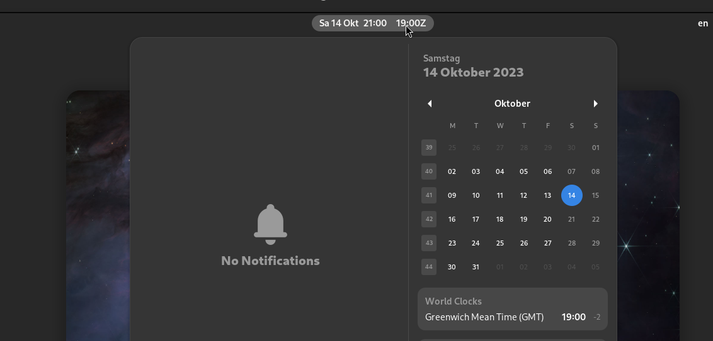

# UTC clock for GNOME shell

[](https://extensions.gnome.org/extension/6409/utc-clock/)
[](https://github.com/swsnr/gnome-shell-extension-utc-clock/releases/)
[](https://translate.codeberg.org/engage/utc-clock-swsnr-de/)
[](https://github.com/swsnr/gnome-shell-extension-utc-clock/actions)

A GNOME Shell extension to add a UTC clock with fully customizable format to the panel.



See [GLib.DateTime.format](https://docs.gtk.org/glib/method.DateTime.format.html) for supported format patterns.

## Installation

Install from [extensions.gnome.org](https://extensions.gnome.org/extension/6409/utc-clock/).

Or download the latest ZIP file from [releases](https://github.com/swsnr/gnome-shell-extension-utc-clock/releases),
and install with

```console
$ gnome-extensions install utc-clock@swsnr.de.shell-extension.zip
```

## License

Copyright Sebastian Wiesner <sebastian@swsnr.de>

This program is subject to the terms of the Mozilla Public
License, v. 2.0.If a copy of the MPL was not distributed with this
file, You can obtain one at https://mozilla.org/MPL/2.0/.

Alternatively, this program may be used under the terms
of the GNU General Public License Version 2 or later, as described below:

This program is free software; you can redistribute it and/or modify
it under the terms of the GNU General Public License as published by
the Free Software Foundation; either version 2 of the License, or
(at your option) any later version.

This program is distributed in the hope that it will be useful,
but WITHOUT ANY WARRANTY; without even the implied warranty of
MERCHANTABILITY or FITNESS FOR A PARTICULAR PURPOSE.  See the
GNU General Public License for more details.
